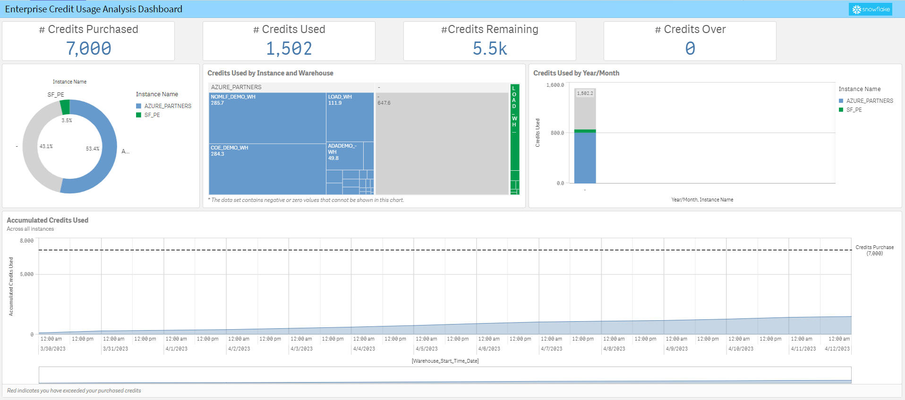

**Snowflake Usage Dashboard (UPDATED V5)**

**NEW!!! – Snowflake Usage Dashboard V5**

Link to the Qlik Sense Application: [<u>Snowflake Usage V5
.qvf</u>](https://github.com/Qlik-PE/Snowflake-Usage-Analysis-Dashboard/blob/master/releases/SnowflakeUsageDashboard_V5/Snowflake_Usage_V5.0.qvf)

What’s new in Snowflake Dashboard (V5):
**Video of the NEW Version 5 Dashboard in action:** [<u>-> Video Link <-</u>](https://github.com/Qlik-PE/Snowflake-Usage-Analysis-Dashboard/blob/master/media/Version5ChangesAndConfiguration.mp4)
  
Version 5 adds Query Performance Tracking - highlighting bad/poorly performing queries with visual query tracing!

**NEW!!! – Snowflake Usage Dashboard V4**

Link to the Qlik Sense Application: [<u>Snowflake Usage V4
.qvf</u>](https://github.com/Qlik-PE/Snowflake-Usage-Analysis-Dashboard/blob/master/releases/SnowflakeUsageDashboard_V5/Snowflake_Usage_V5.0.qvf)

What’s new in Snowflake Dashboard (V5):
**Video of the NEW Version 4 Dashboard in action:** [<u>-> Video Link <-</u>]((https://youtu.be/tVU78hXznVg)
  
Version 4 of the Qlik Snowflake Usage Dashboard is designed with the big implementations in mind. Incremental loads are used for the tables so that you can keep accumulating massive history without the cost/time of having to read it all live. All of the query history is retained and saved to QVD for use in a specific Query Analysis application, but only the aggregates are retained in the main application. Thus, allowing very nimble responses and yet providing an easy to link to the details when anyone wants to analyze them.

What’s new in Snowflake Dashboard (V3.2):

This version is trimmed down on Query Text (left 100) to limit data, and removes around 40 unused columns. The 3.2 version is 50% smaller than the 3.1 version of the Usage Dashboard

What’s new in Snowflake Dashboard (V3):

This Qlik Sense app combines data from multiple Snowflake tables to
create an understanding of four key areas.

\- Cost / Usage Analysis: What is the cost of your usage?

-Auditing/ Security: Who is driving usage?

\- Performance & Optimization: Which queries are driving usage?

\- Connection Details: Which Qlik products are driving your usage?

Also, we have created a TOC and Configuration page to set variables
specific to your Snowflake configuration.

**Sections of the Qlik Application:**

**Usage Cost Analysis**: Analysis by various factors how Snowflake
credits/spend are being consumed

**Enterprise Credit Usage Analysis**: Allows investigation of
credit/usage spend against a pre-bought credit pack from Snowflake
(Enterprise Customers)

**Auditing/Security**: Tracks logins and location from IP’s that access
Snowflake (We are using Qlik GeoAnalytics for IP lookup to location).
Failed/Successful logins and type of connection used by version

**Query Performance Analytics**: Tracks details of query performance,
find anomalies and issues quickly, also breaks out usage by Qlik
product.

**Connection Details (NEW)**: Understand which products are contributing
to costs and query usage. Understand all the types of connection strings
used to access Snowflake.

**Database Details (NEW)**: Understand the data structures of you
Snowflake instance. Columns, Rows, Storage, etc and how all the
Databases, Schemas, Tables, and Columns correlate. Also tracks
shared(external) vs internally owned tables.
