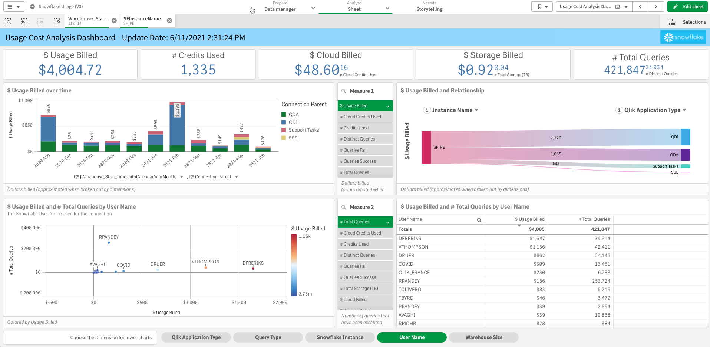

**Snowflake Usage Dashboard (UPDATED V3)**

**NEW!!! – Snowflake Usage Dashboard V3.2**

Link to the Qlik Sense Application (empty): [<u>Snowflake Usage V3.2)
.qvf</u>](https://github.com/Qlik-PE/Snowflake-Usage-Analysis-Dashboard/blob/master/releases/version3/Snowflake%20Usage%20V3.2.qvf)

What’s new in Snowflake Dashboard (V3.2):

This version is trimmed down on Query Test (left 100) to limit data, and removes around 40 unused columns. The 3.2 version is 50% smaller than the 3.1 version of the Usage Dashboard

What’s new in Snowflake Dashboard (V3):

This Qlik Sense app combines data from multiple Snowflake tables to
create an understanding of four key areas.

\- Cost / Usage Analysis: What is the cost of your usage?

-Auditing/ Security: Who is driving usage?

\- Performance & Optimization: Which queries are driving usage?

\- Connection Details: Which Qlik products are driving your usage?

Also, we have created a TOC and Configuration page to set variables
specific to your Snowflake configuration.

**Sections of the Qlik Application:**

**Usage Cost Analysis**: Analysis by various factors how Snowflake
credits/spend are being consumed

**Enterprise Credit Usage Analysis**: Allows investigation of
credit/usage spend against a pre-bought credit pack from Snowflake
(Enterprise Customers)

**Auditing/Security**: Tracks logins and location from IP’s that access
Snowflake (We are using Qlik GeoAnalytics for IP lookup to location).
Failed/Successful logins and type of connection used by version

**Query Performance Analytics**: Tracks details of query performance,
find anomalies and issues quickly, also breaks out usage by Qlik
product.

**Connection Details (NEW)**: Understand which products are contributing
to costs and query usage. Understand all the types of connection strings
used to access Snowflake.

**Database Details (NEW)**: Understand the data structures of you
Snowflake instance. Columns, Rows, Storage, etc and how all the
Databases, Schemas, Tables, and Columns correlate. Also tracks
shared(external) vs internally owned tables.
